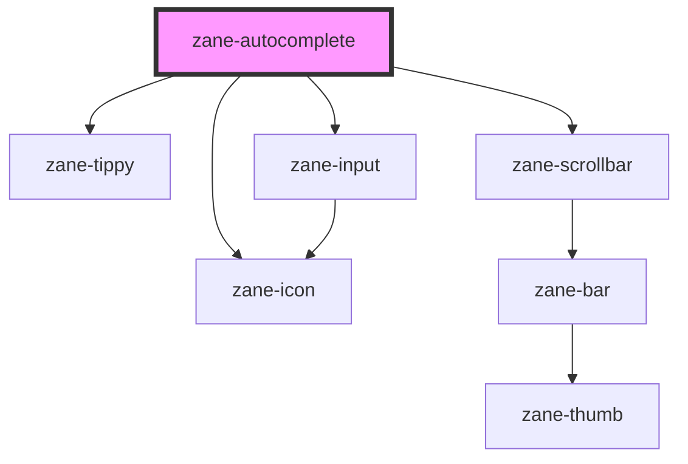

# zane-autocomplete

<!-- Auto Generated Below -->

## Properties

| Property              | Attribute               | Description | Type                                                                                                                        | Default                |
| --------------------- | ----------------------- | ----------- | --------------------------------------------------------------------------------------------------------------------------- | ---------------------- |
| `ariaLabel`           | `aria-label`            |             | `string`                                                                                                                    | `undefined`            |
| `autosize`            | `autosize`              |             | `boolean \| { maxRows?: number; minRows?: number; }`                                                                        | `false`                |
| `clearIcon`           | `clear-icon`            |             | `string`                                                                                                                    | `'close-circle-line'`  |
| `clearable`           | `clearable`             |             | `boolean`                                                                                                                   | `undefined`            |
| `debounce`            | `debounce`              |             | `number`                                                                                                                    | `300`                  |
| `disabled`            | `disabled`              |             | `boolean`                                                                                                                   | `undefined`            |
| `fetchSuggestions`    | --                      |             | `((queryString: string, cb: AutocompleteFetchSuggestionsCallback) => Awaitable<AutocompleteData>) \| Record<string, any>[]` | `NOOP`                 |
| `fitInputWidth`       | `fit-input-width`       |             | `boolean`                                                                                                                   | `undefined`            |
| `form`                | `form`                  |             | `string`                                                                                                                    | `undefined`            |
| `formatter`           | --                      |             | `any \| string`                                                                                                             | `undefined`            |
| `hideLoading`         | `hide-loading`          |             | `boolean`                                                                                                                   | `undefined`            |
| `highlightFirstItem`  | `highlight-first-item`  |             | `boolean`                                                                                                                   | `undefined`            |
| `inputStyle`          | `input-style`           |             | `string`                                                                                                                    | `mutable({} as const)` |
| `loadingRender`       | --                      |             | `() => HTMLElement`                                                                                                         | `undefined`            |
| `loopNavigation`      | `loop-navigation`       |             | `boolean`                                                                                                                   | `true`                 |
| `max`                 | `max`                   |             | `number`                                                                                                                    | `undefined`            |
| `maxLength`           | `max-length`            |             | `number \| string`                                                                                                          | `undefined`            |
| `min`                 | `min`                   |             | `number`                                                                                                                    | `undefined`            |
| `minLength`           | `min-length`            |             | `number \| string`                                                                                                          | `undefined`            |
| `name`                | `name`                  |             | `string`                                                                                                                    | `undefined`            |
| `parser`              | --                      |             | `any`                                                                                                                       | `undefined`            |
| `placeholder`         | `placeholder`           |             | `string`                                                                                                                    | `undefined`            |
| `placement`           | `placement`             |             | `"bottom-start" \| "top-start"`                                                                                             | `'bottom-start'`       |
| `popperTheme`         | `popper-theme`          |             | `string`                                                                                                                    | `'autocomplete'`       |
| `prefixIcon`          | `prefix-icon`           |             | `string`                                                                                                                    | `undefined`            |
| `resize`              | `resize`                |             | `"both" \| "horizontal" \| "none" \| "vertical"`                                                                            | `undefined`            |
| `rows`                | `rows`                  |             | `number`                                                                                                                    | `2`                    |
| `selectWhenUnmatched` | `select-when-unmatched` |             | `boolean`                                                                                                                   | `undefined`            |
| `showPassword`        | `show-password`         |             | `boolean`                                                                                                                   | `undefined`            |
| `showWordLimit`       | `show-word-limit`       |             | `boolean`                                                                                                                   | `undefined`            |
| `size`                | `size`                  |             | `"" \| "default" \| "large" \| "small"`                                                                                     | `undefined`            |
| `step`                | `step`                  |             | `number`                                                                                                                    | `undefined`            |
| `suffixIcon`          | `suffix-icon`           |             | `string`                                                                                                                    | `undefined`            |
| `suggestionRender`    | --                      |             | `(item: any) => HTMLElement`                                                                                                | `undefined`            |
| `triggerOnFocus`      | `trigger-on-focus`      |             | `boolean`                                                                                                                   | `true`                 |
| `type`                | `type`                  |             | `string`                                                                                                                    | `'text'`               |
| `validateEvent`       | `validate-event`        |             | `boolean`                                                                                                                   | `true`                 |
| `value`               | `value`                 |             | `number \| string`                                                                                                          | `''`                   |
| `valueKey`            | `value-key`             |             | `string`                                                                                                                    | `'value'`              |
| `wordLimitPosition`   | `word-limit-position`   |             | `"inside" \| "outside"`                                                                                                     | `'inside'`             |
| `zInputMode`          | `inputmode`             |             | `"decimal" \| "email" \| "none" \| "numeric" \| "search" \| "tel" \| "text" \| "url"`                                       | `undefined`            |
| `zTabindex`           | `tabindex`              |             | `number \| string`                                                                                                          | `0`                    |

## Events

| Event     | Description | Type               |
| --------- | ----------- | ------------------ |
| `zBlur`   |             | `CustomEvent<any>` |
| `zChange` |             | `CustomEvent<any>` |
| `zClear`  |             | `CustomEvent<any>` |
| `zFocus`  |             | `CustomEvent<any>` |
| `zInput`  |             | `CustomEvent<any>` |
| `zSelect` |             | `CustomEvent<any>` |

## Methods

### `close() => Promise<void>`

#### Returns

Type: `Promise<void>`

### `getData(queryString: string) => Promise<void>`

#### Parameters

| Name          | Type     | Description |
| ------------- | -------- | ----------- |
| `queryString` | `string` |             |

#### Returns

Type: `Promise<void>`

### `handleKeyEnter() => Promise<void>`

#### Returns

Type: `Promise<void>`

### `handleSelect(item: any) => Promise<void>`

#### Parameters

| Name   | Type  | Description |
| ------ | ----- | ----------- |
| `item` | `any` |             |

#### Returns

Type: `Promise<void>`

### `highlight(index: number) => Promise<void>`

#### Parameters

| Name    | Type     | Description |
| ------- | -------- | ----------- |
| `index` | `number` |             |

#### Returns

Type: `Promise<void>`

### `inputBlur() => Promise<void>`

#### Returns

Type: `Promise<void>`

### `inputFocus() => Promise<void>`

#### Returns

Type: `Promise<void>`

## Dependencies

### Depends on

- [zane-tippy](../tippy)
- [zane-input](../input)
- [zane-scrollbar](../scrollbar)
- [zane-icon](../icon)

### Graph

----------------------------------------------

*Built with [StencilJS](https://stenciljs.com/)*
