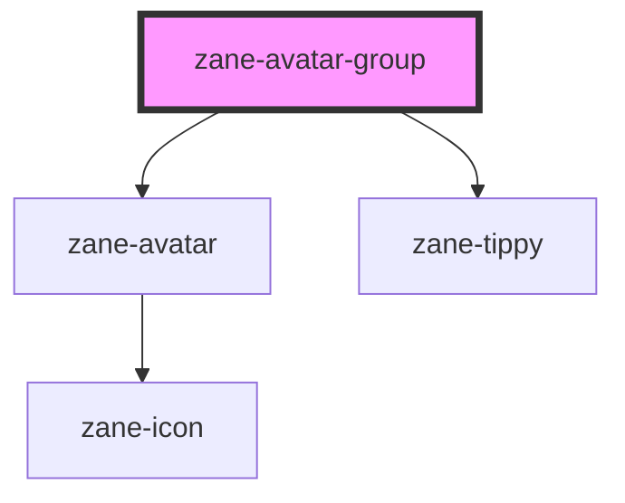

# zane-avatar

<!-- Auto Generated Below -->

## Properties

| Property                 | Attribute                  | Description | Type                                                                                                                                                                                                         | Default          |
| ------------------------ | -------------------------- | ----------- | ------------------------------------------------------------------------------------------------------------------------------------------------------------------------------------------------------------ | ---------------- |
| `avatars`                | --                         |             | `string[]`                                                                                                                                                                                                   | `undefined`      |
| `collapseAvatars`        | `collapse-avatars`         |             | `boolean`                                                                                                                                                                                                    | `false`          |
| `collapseAvatarsTooltip` | `collapse-avatars-tooltip` |             | `boolean`                                                                                                                                                                                                    | `false`          |
| `collapseClass`          | `collapse-class`           |             | `string`                                                                                                                                                                                                     | `undefined`      |
| `collapseStyle`          | --                         |             | `any \| string`                                                                                                                                                                                              | `undefined`      |
| `effect`                 | `effect`                   |             | `"dark" \| "light"`                                                                                                                                                                                          | `'light'`        |
| `maxCollapseAvatars`     | `max-collapse-avatars`     |             | `number`                                                                                                                                                                                                     | `1`              |
| `placement`              | `placement`                |             | `"auto" \| "auto-end" \| "auto-start" \| "bottom" \| "bottom-end" \| "bottom-start" \| "left" \| "left-end" \| "left-start" \| "right" \| "right-end" \| "right-start" \| "top" \| "top-end" \| "top-start"` | `'bottom-start'` |
| `popperBoxClass`         | `popper-box-class`         |             | `string`                                                                                                                                                                                                     | `undefined`      |
| `popperContentClass`     | `popper-content-class`     |             | `string`                                                                                                                                                                                                     | `undefined`      |
| `popperOptions`          | --                         |             | `{ placement: Placement; modifiers: Partial<Modifier<any, any>>[]; strategy: PositioningStrategy; onFirstUpdate?: (arg0: Partial<State>) => void; }`                                                         | `{}`             |
| `popperTheme`            | `popper-theme`             |             | `string`                                                                                                                                                                                                     | `undefined`      |
| `shape`                  | `shape`                    |             | `"circle" \| "square"`                                                                                                                                                                                       | `'circle'`       |
| `size`                   | `size`                     |             | `"default" \| "large" \| "small" \| number`                                                                                                                                                                  | `'default'`      |

## Dependencies

### Depends on

- [zane-avatar](.)
- [zane-tippy](../tippy)

### Graph

----------------------------------------------

*Built with [StencilJS](https://stenciljs.com/)*
