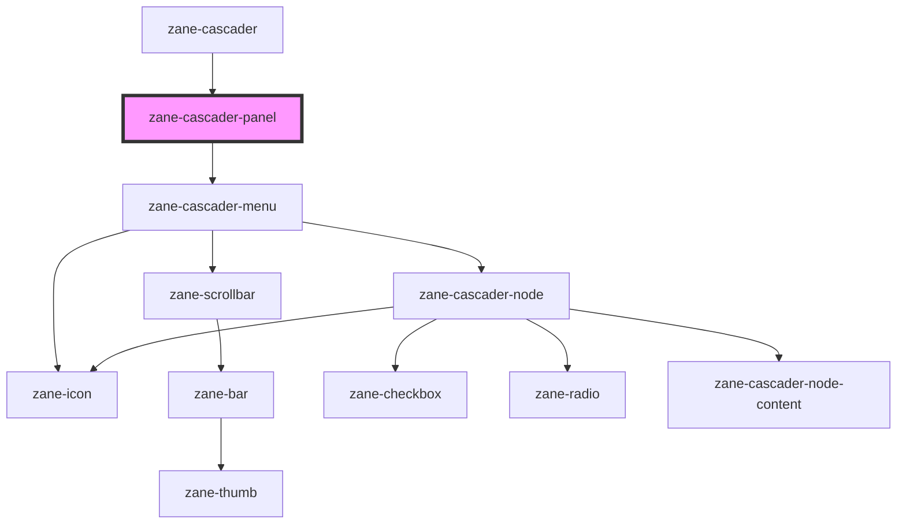

# zane-cascader-panel

<!-- Auto Generated Below -->

## Properties

| Property       | Attribute | Description | Type                                                                                               | Default     |
| -------------- | --------- | ----------- | -------------------------------------------------------------------------------------------------- | ----------- |
| `border`       | `border`  |             | `boolean`                                                                                          | `true`      |
| `checkedNodes` | --        |             | `CascaderNode[]`                                                                                   | `[]`        |
| `options`      | --        |             | `CascaderOption[]`                                                                                 | `[]`        |
| `props`        | --        |             | `CascaderProps`                                                                                    | `{}`        |
| `renderLabel`  | --        |             | `(props: RenderLabelProps) => HTMLElement`                                                         | `undefined` |
| `value`        | `value`   |             | `(CascaderNodeValue \| CascaderNodePathValue)[] \| CascaderNodeValue[] \| any \| number \| string` | `undefined` |

## Events

| Event           | Description | Type                                                                                                            |
| --------------- | ----------- | --------------------------------------------------------------------------------------------------------------- |
| `zChange`       |             | `CustomEvent<(CascaderNodeValue \| CascaderNodePathValue)[] \| CascaderNodeValue[] \| any \| number \| string>` |
| `zClose`        |             | `CustomEvent<void>`                                                                                             |
| `zExpandChange` |             | `CustomEvent<CascaderNodeValue[]>`                                                                              |

## Methods

### `calculateCheckedValue() => Promise<void>`

#### Returns

Type: `Promise<void>`

### `clearCheckedNodes() => Promise<void>`

#### Returns

Type: `Promise<void>`

### `getCheckedNodes(leafOnly: boolean) => Promise<CascaderNode[]>`

#### Parameters

| Name       | Type      | Description |
| ---------- | --------- | ----------- |
| `leafOnly` | `boolean` |             |

#### Returns

Type: `Promise<CascaderNode[]>`

### `getContext() => Promise<ReactiveObject<CascaderPanelContext>>`

#### Returns

Type: `Promise<ReactiveObject<CascaderPanelContext>>`

### `getFlattedNodes(leafOnly: boolean) => Promise<CascaderNode[]>`

#### Parameters

| Name       | Type      | Description |
| ---------- | --------- | ----------- |
| `leafOnly` | `boolean` |             |

#### Returns

Type: `Promise<CascaderNode[]>`

### `handleCheckChange(node: CascaderNode, checked: boolean, emitClose?: boolean) => Promise<void>`

#### Parameters

| Name        | Type           | Description |
| ----------- | -------------- | ----------- |
| `node`      | `CascaderNode` |             |
| `checked`   | `boolean`      |             |
| `emitClose` | `boolean`      |             |

#### Returns

Type: `Promise<void>`

### `loadLazyRootNodes() => Promise<void>`

#### Returns

Type: `Promise<void>`

### `scrollToExpandingNode() => Promise<void>`

#### Returns

Type: `Promise<void>`

## Dependencies

### Used by

 - [zane-cascader](.)

### Depends on

- [zane-cascader-menu](.)

### Graph

----------------------------------------------

*Built with [StencilJS](https://stenciljs.com/)*
