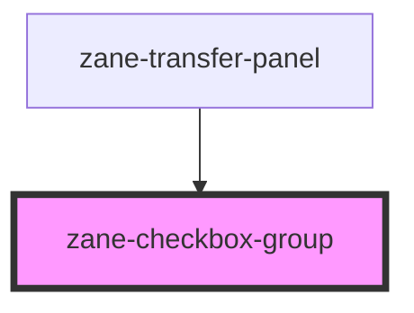

# zane-checkbox-group

<!-- Auto Generated Below -->

## Properties

| Property        | Attribute        | Description | Type                                                     | Default                                                                   |
| --------------- | ---------------- | ----------- | -------------------------------------------------------- | ------------------------------------------------------------------------- |
| `ariaLabel`     | `aria-label`     |             | `string`                                                 | `undefined`                                                               |
| `disabled`      | `disabled`       |             | `boolean`                                                | `undefined`                                                               |
| `fill`          | `fill`           |             | `string`                                                 | `undefined`                                                               |
| `label`         | `label`          |             | `string`                                                 | `undefined`                                                               |
| `max`           | `max`            |             | `number`                                                 | `undefined`                                                               |
| `min`           | `min`            |             | `number`                                                 | `undefined`                                                               |
| `options`       | --               |             | `CheckboxOption[]`                                       | `undefined`                                                               |
| `props`         | --               |             | `{ value?: string; label?: string; disabled?: string; }` | `{     label: "label",     value: "value",     disabled: "disabled",   }` |
| `size`          | `size`           |             | `"" \| "default" \| "large" \| "small"`                  | `undefined`                                                               |
| `tag`           | `tag`            |             | `string`                                                 | `"div"`                                                                   |
| `textColor`     | `text-color`     |             | `string`                                                 | `undefined`                                                               |
| `type`          | `type`           |             | `"button" \| "checkbox"`                                 | `"checkbox"`                                                              |
| `validateEvent` | `validate-event` |             | `boolean`                                                | `true`                                                                    |
| `value`         | --               |             | `(string \| number)[]`                                   | `[]`                                                                      |
| `zId`           | `id`             |             | `string`                                                 | `undefined`                                                               |

## Events

| Event     | Description | Type                                |
| --------- | ----------- | ----------------------------------- |
| `zChange` |             | `CustomEvent<(string \| number)[]>` |

## Methods

### `getContext() => Promise<ReactiveObject<CheckboxGroupContext>>`

#### Returns

Type: `Promise<ReactiveObject<CheckboxGroupContext>>`

## Dependencies

### Used by

 - [zane-transfer-panel](../transfer)

### Graph

----------------------------------------------

*Built with [StencilJS](https://stenciljs.com/)*
