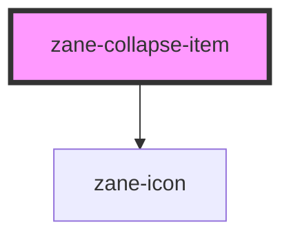

# zane-collapse

<!-- Auto Generated Below -->

## Properties

| Property   | Attribute  | Description | Type               | Default         |
| ---------- | ---------- | ----------- | ------------------ | --------------- |
| `disabled` | `disabled` |             | `boolean`          | `false`         |
| `icon`     | `icon`     |             | `string`           | `'arrow-right'` |
| `label`    | `title`    |             | `string`           | `''`            |
| `name`     | `name`     |             | `number \| string` | `undefined`     |

## Dependencies

### Depends on

- [zane-icon](../icon)

### Graph

----------------------------------------------

*Built with [StencilJS](https://stenciljs.com/)*
