# zane-icon

<!-- Auto Generated Below -->

## Properties

| Property    | Attribute    | Description | Type      | Default     |
| ----------- | ------------ | ----------- | --------- | ----------- |
| `color`     | `color`      |             | `string`  | `undefined` |
| `iconClass` | `icon-class` |             | `string`  | `''`        |
| `name`      | `name`       |             | `string`  | `undefined` |
| `rotate`    | `rotate`     |             | `number`  | `undefined` |
| `size`      | `size`       |             | `string`  | `undefined` |
| `spin`      | `spin`       |             | `boolean` | `false`     |
| `styles`    | --           |             | `object`  | `undefined` |
| `zPrefix`   | `prefix`     |             | `string`  | `undefined` |

## Dependencies

### Used by

 - [zane-autocomplete](../autocomplete)
 - [zane-avatar](../avatar)
 - [zane-button](../button)
 - [zane-carousel](../carousel)
 - [zane-cascader](../cascader)
 - [zane-cascader-menu](../cascader)
 - [zane-cascader-node](../cascader)
 - [zane-collapse-item](../collapse)
 - [zane-input](../input)
 - [zane-input-number](../input-number)
 - [zane-input-tag](../input-tag)
 - [zane-link](../link)
 - [zane-pagination](../pagination)
 - [zane-progress](../progress)
 - [zane-rate](../rate)
 - [zane-select](../select)
 - [zane-select-virtual](../select-virtual)
 - [zane-splitter-bar](../splitter)
 - [zane-switch](../switch)
 - [zane-tag](../tag)
 - [zane-timeline-item](../timeline)
 - [zane-transfer](../transfer)
 - [zane-tree-node](../tree)
 - [zane-upload](../upload)

### Graph

```mermaid
graph TD;
  zane-autocomplete --> zane-icon
  zane-avatar --> zane-icon
  zane-button --> zane-icon
  zane-carousel --> zane-icon
  zane-cascader --> zane-icon
  zane-cascader-menu --> zane-icon
  zane-cascader-node --> zane-icon
  zane-collapse-item --> zane-icon
  zane-input --> zane-icon
  zane-input-number --> zane-icon
  zane-input-tag --> zane-icon
  zane-link --> zane-icon
  zane-pagination --> zane-icon
  zane-progress --> zane-icon
  zane-rate --> zane-icon
  zane-select --> zane-icon
  zane-select-virtual --> zane-icon
  zane-splitter-bar --> zane-icon
  zane-switch --> zane-icon
  zane-tag --> zane-icon
  zane-timeline-item --> zane-icon
  zane-transfer --> zane-icon
  zane-tree-node --> zane-icon
  zane-upload --> zane-icon
  style zane-icon fill:#f9f,stroke:#333,stroke-width:4px
```

----------------------------------------------

*Built with [StencilJS](https://stenciljs.com/)*
