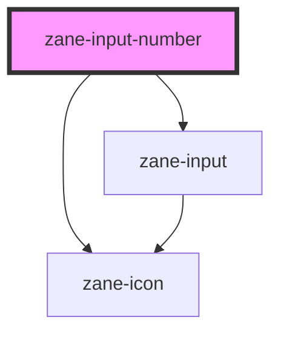

# zane-input-number

<!-- Auto Generated Below -->

## Properties

| Property             | Attribute             | Description | Type                                                                                  | Default                   |
| -------------------- | --------------------- | ----------- | ------------------------------------------------------------------------------------- | ------------------------- |
| `align`              | `align`               |             | `"center" \| "left" \| "right"`                                                       | `"center"`                |
| `ariaLabel`          | `aria-label`          |             | `string`                                                                              | `undefined`               |
| `controls`           | `controls`            |             | `boolean`                                                                             | `true`                    |
| `controlsPosition`   | `controls-position`   |             | `"" \| "right"`                                                                       | `""`                      |
| `disabled`           | `disabled`            |             | `boolean`                                                                             | `undefined`               |
| `disabledScientific` | `disabled-scientific` |             | `boolean`                                                                             | `undefined`               |
| `max`                | `max`                 |             | `number`                                                                              | `Number.MAX_SAFE_INTEGER` |
| `min`                | `min`                 |             | `number`                                                                              | `Number.MIN_SAFE_INTEGER` |
| `name`               | `name`                |             | `string`                                                                              | `undefined`               |
| `placeholder`        | `placeholder`         |             | `string`                                                                              | `undefined`               |
| `precision`          | `precision`           |             | `number`                                                                              | `undefined`               |
| `readonly`           | `readonly`            |             | `boolean`                                                                             | `undefined`               |
| `size`               | `size`                |             | `"" \| "default" \| "large" \| "small"`                                               | `undefined`               |
| `step`               | `step`                |             | `number`                                                                              | `1`                       |
| `stepStrictly`       | `step-strictly`       |             | `boolean`                                                                             | `undefined`               |
| `validateEvent`      | `validate-event`      |             | `boolean`                                                                             | `true`                    |
| `value`              | `value`               |             | `number`                                                                              | `null`                    |
| `valueOnClear`       | `value-on-clear`      |             | `"max" \| "min" \| number`                                                            | `null`                    |
| `zId`                | `id`                  |             | `string`                                                                              | `undefined`               |
| `zInputMode`         | `inputmode`           |             | `"decimal" \| "email" \| "none" \| "numeric" \| "search" \| "tel" \| "text" \| "url"` | `undefined`               |

## Events

| Event     | Description | Type                      |
| --------- | ----------- | ------------------------- |
| `zBlur`   |             | `CustomEvent<FocusEvent>` |
| `zChange` |             | `CustomEvent<number>`     |
| `zFocus`  |             | `CustomEvent<FocusEvent>` |
| `zInput`  |             | `CustomEvent<number>`     |

## Methods

### `zBlur() => Promise<void>`

#### Returns

Type: `Promise<void>`

### `zFocus() => Promise<void>`

#### Returns

Type: `Promise<void>`

## Dependencies

### Depends on

- [zane-icon](../icon)
- [zane-input](../input)

### Graph

----------------------------------------------

*Built with [StencilJS](https://stenciljs.com/)*
