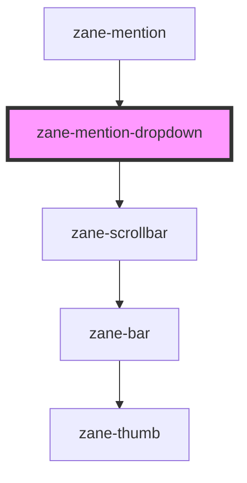

# zane-mention-dropdown

<!-- Auto Generated Below -->

## Properties

| Property        | Attribute        | Description | Type              | Default     |
| --------------- | ---------------- | ----------- | ----------------- | ----------- |
| `ariaLabel`     | `aria-label`     |             | `string`          | `undefined` |
| `disabled`      | `disabled`       |             | `boolean`         | `undefined` |
| `hoveringIndex` | `hovering-index` |             | `number`          | `-1`        |
| `loading`       | `loading`        |             | `boolean`         | `undefined` |
| `options`       | --               |             | `MentionOption[]` | `[]`        |

## Events

| Event     | Description | Type                                                                                       |
| --------- | ----------- | ------------------------------------------------------------------------------------------ |
| `zSelect` |             | `CustomEvent<{ [key: string]: any; value?: string; label?: string; disabled?: boolean; }>` |

## Methods

### `navigateOptions(direction: "next" | "prev") => Promise<void>`

#### Parameters

| Name        | Type               | Description |
| ----------- | ------------------ | ----------- |
| `direction` | `"next" \| "prev"` |             |

#### Returns

Type: `Promise<void>`

### `selectHoverOption() => Promise<void>`

#### Returns

Type: `Promise<void>`

## Dependencies

### Used by

 - [zane-mention](.)

### Depends on

- [zane-scrollbar](../scrollbar)

### Graph

----------------------------------------------

*Built with [StencilJS](https://stenciljs.com/)*
