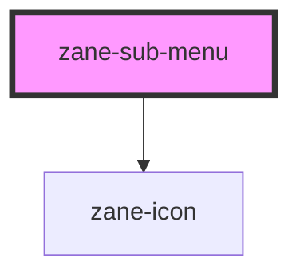

# zane-sub-menu

<!-- Auto Generated Below -->

## Properties

| Property      | Attribute      | Description | Type      | Default |
| ------------- | -------------- | ----------- | --------- | ------- |
| `disabled`    | `disabled`     |             | `boolean` | `false` |
| `hideTimeout` | `hide-timeout` |             | `number`  | `300`   |
| `index`       | `index`        |             | `string`  | `''`    |
| `popperClass` | `popper-class` |             | `string`  | `''`    |
| `showTimeout` | `show-timeout` |             | `number`  | `300`   |

## Dependencies

### Depends on

- [zane-icon](../icon)

### Graph

----------------------------------------------

*Built with [StencilJS](https://stenciljs.com/)*
