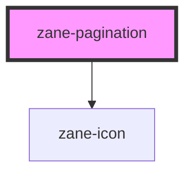

# zane-pagination

<!-- Auto Generated Below -->

## Properties

| Property             | Attribute              | Description             | Type                                    | Default                   |
| -------------------- | ---------------------- | ----------------------- | --------------------------------------- | ------------------------- |
| `background`         | `background`           | 是否带背景色                  | `boolean`                               | `false`                   |
| `currentPage`        | `current-page`         | 当前页码（受控）                | `number`                                | `undefined`               |
| `defaultCurrentPage` | `default-current-page` | 默认当前页码                  | `number`                                | `1`                       |
| `defaultPageSize`    | `default-page-size`    | 默认每页条数                  | `number`                                | `10`                      |
| `disabled`           | `disabled`             | 是否禁用                    | `boolean`                               | `false`                   |
| `hideOnSinglePage`   | `hide-on-single-page`  | 只有一页时是否隐藏               | `boolean`                               | `false`                   |
| `layout`             | `layout`               | 布局配置，逗号分隔               | `string`                                | `DEFAULT_LAYOUT`          |
| `nextIcon`           | `next-icon`            | 下一页按钮图标                 | `string`                                | `'arrow-right-s-line'`    |
| `nextText`           | `next-text`            | 下一页按钮文字                 | `string`                                | `''`                      |
| `pageCount`          | `page-count`           | 总页数（优先于 total）          | `number`                                | `undefined`               |
| `pageSize`           | `page-size`            | 每页条数（受控）                | `number`                                | `undefined`               |
| `pageSizes`          | `page-sizes`           | 每页条数选项列表 — 支持数组或逗号分隔字符串 | `number[] \| string`                    | `[...DEFAULT_PAGE_SIZES]` |
| `pagerCount`         | `pager-count`          | 显示的页码按钮数量（必须为大于4的奇数）    | `number`                                | `DEFAULT_PAGE_COUNT`      |
| `prevIcon`           | `prev-icon`            | 上一页按钮图标                 | `string`                                | `'arrow-left-s-line'`     |
| `prevText`           | `prev-text`            | 上一页按钮文字                 | `string`                                | `''`                      |
| `size`               | `size`                 | 组件尺寸                    | `"" \| "default" \| "large" \| "small"` | `undefined`               |
| `total`              | `total`                | 总记录数                    | `number`                                | `undefined`               |

## Events

| Event            | Description                    | Type                                                      |
| ---------------- | ------------------------------ | --------------------------------------------------------- |
| `zChange`        | 综合变化事件（currentPage + pageSize） | `CustomEvent<{ currentPage: number; pageSize: number; }>` |
| `zCurrentChange` | 当前页变化事件                        | `CustomEvent<number>`                                     |
| `zNextClick`     | 点击下一页按钮事件                      | `CustomEvent<number>`                                     |
| `zPrevClick`     | 点击上一页按钮事件                      | `CustomEvent<number>`                                     |
| `zSizeChange`    | 每页条数变化事件                       | `CustomEvent<number>`                                     |

## Dependencies

### Depends on

- [zane-icon](../icon)

### Graph

----------------------------------------------

*Built with [StencilJS](https://stenciljs.com/)*
