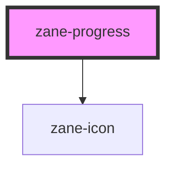

# zane-progress

<!-- Auto Generated Below -->

## Properties

| Property        | Attribute        | Description | Type                                          | Default   |
| --------------- | ---------------- | ----------- | --------------------------------------------- | --------- |
| `color`         | `color`          |             | `string`                                      | `''`      |
| `duration`      | `duration`       |             | `number`                                      | `3`       |
| `indeterminate` | `indeterminate`  |             | `boolean`                                     | `false`   |
| `percentage`    | `percentage`     |             | `number`                                      | `0`       |
| `showText`      | `show-text`      |             | `boolean`                                     | `true`    |
| `status`        | `status`         |             | `"" \| "exception" \| "success" \| "warning"` | `''`      |
| `striped`       | `striped`        |             | `boolean`                                     | `false`   |
| `stripedFlow`   | `striped-flow`   |             | `boolean`                                     | `false`   |
| `strokeLinecap` | `stroke-linecap` |             | `"butt" \| "round" \| "square"`               | `'round'` |
| `strokeWidth`   | `stroke-width`   |             | `number`                                      | `6`       |
| `textInside`    | `text-inside`    |             | `boolean`                                     | `false`   |
| `type`          | `type`           |             | `"circle" \| "dashboard" \| "line"`           | `'line'`  |
| `width`         | `width`          |             | `number`                                      | `126`     |

## Dependencies

### Depends on

- [zane-icon](../icon)

### Graph

----------------------------------------------

*Built with [StencilJS](https://stenciljs.com/)*
