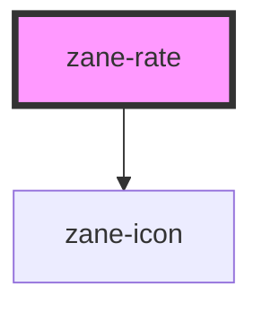

# zane-rate

<!-- Auto Generated Below -->

## Properties

| Property            | Attribute             | Description | Type                                    | Default                                                              |
| ------------------- | --------------------- | ----------- | --------------------------------------- | -------------------------------------------------------------------- |
| `allowHalf`         | `allow-half`          |             | `boolean`                               | `undefined`                                                          |
| `ariaLabel`         | `aria-label`          |             | `string`                                | `undefined`                                                          |
| `clearable`         | `clearable`           |             | `boolean`                               | `undefined`                                                          |
| `colors`            | --                    |             | `number \| string \| string[]`          | `['', '', '']`                                                       |
| `disabled`          | `disabled`            |             | `boolean`                               | `undefined`                                                          |
| `disabledVoidColor` | `disabled-void-color` |             | `string`                                | `''`                                                                 |
| `disabledVoidIcon`  | `disabled-void-icon`  |             | `string`                                | `'star-fill'`                                                        |
| `highThreshold`     | `high-threshold`      |             | `number`                                | `4`                                                                  |
| `icons`             | --                    |             | `number \| string \| string[]`          | `['star-fill', 'star-fill', 'star-fill']`                            |
| `label`             | `label`               |             | `string`                                | `undefined`                                                          |
| `lowThreshold`      | `low-threshold`       |             | `number`                                | `2`                                                                  |
| `max`               | `max`                 |             | `number`                                | `5`                                                                  |
| `scoreTemplate`     | `score-template`      |             | `string`                                | `'{value}'`                                                          |
| `showScore`         | `show-score`          |             | `boolean`                               | `undefined`                                                          |
| `showText`          | `show-text`           |             | `boolean`                               | `undefined`                                                          |
| `size`              | `size`                |             | `"" \| "default" \| "large" \| "small"` | `undefined`                                                          |
| `textColor`         | `text-color`          |             | `string`                                | `''`                                                                 |
| `texts`             | --                    |             | `string[]`                              | `['Extremely bad', 'Disappointed', 'Fair', 'Satisfied', 'Surprise']` |
| `value`             | `value`               |             | `number`                                | `0`                                                                  |
| `voidColor`         | `void-color`          |             | `string`                                | `''`                                                                 |
| `voidIcon`          | `void-icon`           |             | `string`                                | `'star-line'`                                                        |
| `zId`               | `id`                  |             | `string`                                | `undefined`                                                          |

## Events

| Event     | Description | Type                  |
| --------- | ----------- | --------------------- |
| `zChange` |             | `CustomEvent<number>` |

## Dependencies

### Depends on

- [zane-icon](../icon)

### Graph

----------------------------------------------

*Built with [StencilJS](https://stenciljs.com/)*
