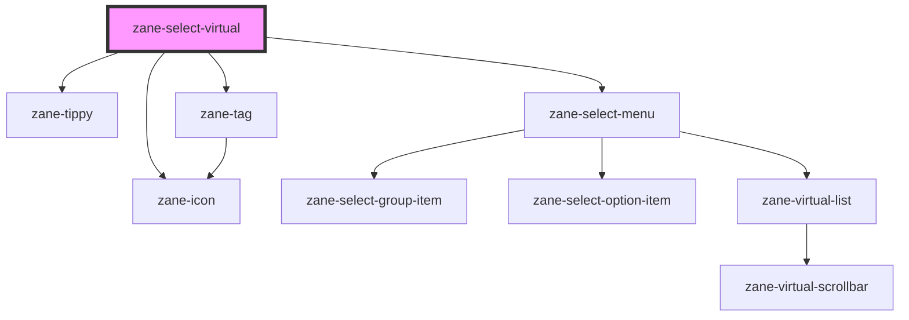

# zane-select-virtual

<!-- Auto Generated Below -->

## Properties

| Property                | Attribute                 | Description | Type                                                                                                                                                                                                         | Default                                                                                          |
| ----------------------- | ------------------------- | ----------- | ------------------------------------------------------------------------------------------------------------------------------------------------------------------------------------------------------------ | ------------------------------------------------------------------------------------------------ |
| `allowCreate`           | `allow-create`            |             | `boolean`                                                                                                                                                                                                    | `undefined`                                                                                      |
| `ariaLabel`             | `aria-label`              |             | `string`                                                                                                                                                                                                     | `undefined`                                                                                      |
| `autocomplete`          | `autocomplete`            |             | `"both" \| "inline" \| "list" \| "none"`                                                                                                                                                                     | `'none'`                                                                                         |
| `automaticDropdown`     | `automatic-dropdown`      |             | `boolean`                                                                                                                                                                                                    | `undefined`                                                                                      |
| `clearIcon`             | `clear-icon`              |             | `string`                                                                                                                                                                                                     | `'close-circle-line'`                                                                            |
| `clearable`             | `clearable`               |             | `boolean`                                                                                                                                                                                                    | `undefined`                                                                                      |
| `collapseTags`          | `collapse-tags`           |             | `boolean`                                                                                                                                                                                                    | `undefined`                                                                                      |
| `collapseTagsTooltip`   | `collapse-tags-tooltip`   |             | `boolean`                                                                                                                                                                                                    | `undefined`                                                                                      |
| `debounce`              | `debounce`                |             | `number`                                                                                                                                                                                                     | `300`                                                                                            |
| `defaultFirstOption`    | `default-first-option`    |             | `boolean`                                                                                                                                                                                                    | `undefined`                                                                                      |
| `disabled`              | `disabled`                |             | `boolean`                                                                                                                                                                                                    | `undefined`                                                                                      |
| `emptyValues`           | --                        |             | `any[]`                                                                                                                                                                                                      | `undefined`                                                                                      |
| `estimatedOptionHeight` | `estimated-option-height` |             | `number`                                                                                                                                                                                                     | `undefined`                                                                                      |
| `filterMethod`          | --                        |             | `(query: string) => boolean`                                                                                                                                                                                 | `undefined`                                                                                      |
| `filterable`            | `filterable`              |             | `boolean`                                                                                                                                                                                                    | `undefined`                                                                                      |
| `fitInputWidth`         | `fit-input-width`         |             | `boolean \| number`                                                                                                                                                                                          | `true`                                                                                           |
| `height`                | `height`                  |             | `number`                                                                                                                                                                                                     | `274`                                                                                            |
| `itemHeight`            | `item-height`             |             | `number`                                                                                                                                                                                                     | `34`                                                                                             |
| `label`                 | `label`                   |             | `string`                                                                                                                                                                                                     | `undefined`                                                                                      |
| `loading`               | `loading`                 |             | `boolean`                                                                                                                                                                                                    | `undefined`                                                                                      |
| `loadingText`           | `loading-text`            |             | `string`                                                                                                                                                                                                     | `undefined`                                                                                      |
| `maxCollapseTags`       | `max-collapse-tags`       |             | `number`                                                                                                                                                                                                     | `1`                                                                                              |
| `multiple`              | `multiple`                |             | `boolean`                                                                                                                                                                                                    | `undefined`                                                                                      |
| `multipleLimit`         | `multiple-limit`          |             | `number`                                                                                                                                                                                                     | `0`                                                                                              |
| `name`                  | `name`                    |             | `string`                                                                                                                                                                                                     | `undefined`                                                                                      |
| `noDataText`            | `no-data-text`            |             | `string`                                                                                                                                                                                                     | `undefined`                                                                                      |
| `noMatchText`           | `no-match-text`           |             | `string`                                                                                                                                                                                                     | `undefined`                                                                                      |
| `offset`                | --                        |             | `(({ placement, popper, reference, }: { placement: Placement; popper: Rect; reference: Rect; }) => [number, number]) \| [number, number]`                                                                    | `tippy.defaultProps.offset`                                                                      |
| `options`               | --                        |             | `OptionType[]`                                                                                                                                                                                               | `undefined`                                                                                      |
| `placeholder`           | `placeholder`             |             | `string`                                                                                                                                                                                                     | `undefined`                                                                                      |
| `placement`             | `placement`               |             | `"auto" \| "auto-end" \| "auto-start" \| "bottom" \| "bottom-end" \| "bottom-start" \| "left" \| "left-end" \| "left-start" \| "right" \| "right-end" \| "right-start" \| "top" \| "top-end" \| "top-start"` | `'bottom-start'`                                                                                 |
| `popperOptions`         | --                        |             | `{ placement: Placement; modifiers: Partial<Modifier<any, any>>[]; strategy: PositioningStrategy; onFirstUpdate?: (arg0: Partial<State>) => void; }`                                                         | `{}`                                                                                             |
| `popperTheme`           | `popper-theme`            |             | `string`                                                                                                                                                                                                     | `undefined`                                                                                      |
| `props`                 | --                        |             | `{ label?: string; value?: string; disabled?: string; options?: string; }`                                                                                                                                   | `{     label: 'label',     value: 'value',     disabled: 'disabled',     options: 'options'   }` |
| `remote`                | `remote`                  |             | `boolean`                                                                                                                                                                                                    | `undefined`                                                                                      |
| `remoteMethod`          | --                        |             | `(query: string) => any`                                                                                                                                                                                     | `undefined`                                                                                      |
| `remoteShowSuffix`      | `remote-show-suffix`      |             | `boolean`                                                                                                                                                                                                    | `undefined`                                                                                      |
| `reserveKeyword`        | `reserve-keyword`         |             | `boolean`                                                                                                                                                                                                    | `true`                                                                                           |
| `scrollbarAlwaysOn`     | `scrollbar-always-on`     |             | `boolean`                                                                                                                                                                                                    | `undefined`                                                                                      |
| `showArrow`             | `show-arrow`              |             | `boolean`                                                                                                                                                                                                    | `false`                                                                                          |
| `size`                  | `size`                    |             | `"" \| "default" \| "large" \| "small"`                                                                                                                                                                      | `undefined`                                                                                      |
| `suffixIcon`            | `suffix-icon`             |             | `string`                                                                                                                                                                                                     | `'arrow-down-s-line'`                                                                            |
| `tagEffect`             | `tag-effect`              |             | `"dark" \| "light" \| "plain"`                                                                                                                                                                               | `'light'`                                                                                        |
| `tagLabelRender`        | --                        |             | `(label: string, value: string, index: number) => HTMLElement`                                                                                                                                               | `undefined`                                                                                      |
| `tagRender`             | --                        |             | `() => HTMLElement`                                                                                                                                                                                          | `undefined`                                                                                      |
| `tagType`               | `tag-type`                |             | `"danger" \| "info" \| "primary" \| "success" \| "warning"`                                                                                                                                                  | `'info'`                                                                                         |
| `validateEvent`         | `validate-event`          |             | `boolean`                                                                                                                                                                                                    | `true`                                                                                           |
| `value`                 | `value`                   |             | `any`                                                                                                                                                                                                        | `undefined`                                                                                      |
| `valueKey`              | `value-key`               |             | `string`                                                                                                                                                                                                     | `'value'`                                                                                        |
| `valueOnClear`          | `value-on-clear`          |             | `any`                                                                                                                                                                                                        | `undefined`                                                                                      |
| `zId`                   | `z-id`                    |             | `string`                                                                                                                                                                                                     | `undefined`                                                                                      |
| `zTabindex`             | `tabindex`                |             | `number`                                                                                                                                                                                                     | `0`                                                                                              |

## Events

| Event                | Description | Type                            |
| -------------------- | ----------- | ------------------------------- |
| `zBlur`              |             | `CustomEvent<FocusEvent>`       |
| `zChange`            |             | `CustomEvent<any>`              |
| `zClear`             |             | `CustomEvent<any>`              |
| `zCompositionEnd`    |             | `CustomEvent<CompositionEvent>` |
| `zCompositionStart`  |             | `CustomEvent<CompositionEvent>` |
| `zCompositionUpdate` |             | `CustomEvent<CompositionEvent>` |
| `zFocus`             |             | `CustomEvent<FocusEvent>`       |
| `zRemoveTag`         |             | `CustomEvent<any>`              |

## Methods

### `getContext() => Promise<ReactiveObject<SelectContext>>`

#### Returns

Type: `Promise<ReactiveObject<SelectContext>>`

### `zBlur() => Promise<void>`

#### Returns

Type: `Promise<void>`

### `zFocus() => Promise<void>`

#### Returns

Type: `Promise<void>`

## Dependencies

### Depends on

- [zane-tippy](../tippy)
- [zane-tag](../tag)
- [zane-icon](../icon)
- [zane-select-menu](.)

### Graph

----------------------------------------------

*Built with [StencilJS](https://stenciljs.com/)*
