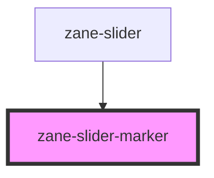

# zane-slider-marker

<!-- Auto Generated Below -->

## Properties

| Property | Attribute | Description | Type                                                    | Default     |
| -------- | --------- | ----------- | ------------------------------------------------------- | ----------- |
| `mark`   | `mark`    |             | `string \| { style: Record<string, any>; label: any; }` | `undefined` |

## Dependencies

### Used by

 - [zane-slider](.)

### Graph

----------------------------------------------

*Built with [StencilJS](https://stenciljs.com/)*
