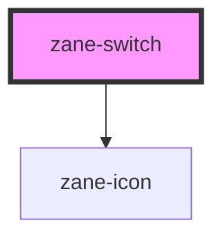

# zane-switch

<!-- Auto Generated Below -->

## Properties

| Property             | Attribute              | Description | Type                                    | Default     |
| -------------------- | ---------------------- | ----------- | --------------------------------------- | ----------- |
| `activeActionIcon`   | `active-action-icon`   |             | `string`                                | `undefined` |
| `activeIcon`         | `active-icon`          |             | `string`                                | `undefined` |
| `activeText`         | `active-text`          |             | `string`                                | `''`        |
| `activeValue`        | `active-value`         |             | `boolean \| number \| string`           | `true`      |
| `ariaLabel`          | `aria-label`           |             | `string`                                | `undefined` |
| `beforeChange`       | --                     |             | `() => boolean \| Promise<boolean>`     | `undefined` |
| `disabled`           | `disabled`             |             | `boolean`                               | `undefined` |
| `inactiveActionIcon` | `inactive-action-icon` |             | `string`                                | `undefined` |
| `inactiveIcon`       | `inactive-icon`        |             | `string`                                | `undefined` |
| `inactiveText`       | `inactive-text`        |             | `string`                                | `''`        |
| `inactiveValue`      | `inactive-value`       |             | `boolean \| number \| string`           | `false`     |
| `inlinePrompt`       | `inline-prompt`        |             | `boolean`                               | `undefined` |
| `loading`            | `loading`              |             | `boolean`                               | `undefined` |
| `name`               | `name`                 |             | `string`                                | `''`        |
| `size`               | `size`                 |             | `"" \| "default" \| "large" \| "small"` | `undefined` |
| `validateEvent`      | `validate-event`       |             | `boolean`                               | `true`      |
| `value`              | `value`                |             | `boolean \| number \| string`           | `false`     |
| `width`              | `width`                |             | `number \| string`                      | `''`        |
| `zId`                | `id`                   |             | `string`                                | `undefined` |
| `zTabindex`          | `tabindex`             |             | `number`                                | `undefined` |

## Events

| Event     | Description | Type                                       |
| --------- | ----------- | ------------------------------------------ |
| `zChange` |             | `CustomEvent<boolean \| number \| string>` |
| `zInput`  |             | `CustomEvent<boolean \| number \| string>` |

## Methods

### `isChecked() => Promise<boolean>`

#### Returns

Type: `Promise<boolean>`

### `zFocus() => Promise<void>`

#### Returns

Type: `Promise<void>`

## Dependencies

### Depends on

- [zane-icon](../icon)

### Graph

----------------------------------------------

*Built with [StencilJS](https://stenciljs.com/)*
