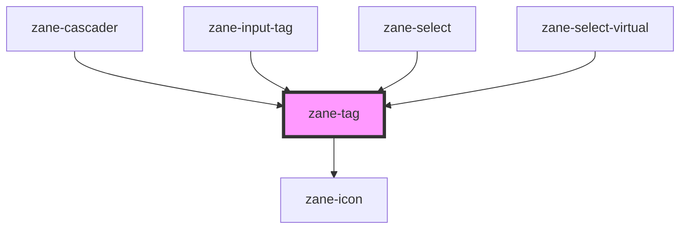

# zane-tag

<!-- Auto Generated Below -->

## Properties

| Property    | Attribute   | Description | Type                                                        | Default     |
| ----------- | ----------- | ----------- | ----------------------------------------------------------- | ----------- |
| `closeable` | `closeable` |             | `boolean`                                                   | `undefined` |
| `color`     | `color`     |             | `string`                                                    | `undefined` |
| `effect`    | `effect`    |             | `"dark" \| "light" \| "plain"`                              | `'light'`   |
| `hit`       | `hit`       |             | `boolean`                                                   | `undefined` |
| `round`     | `round`     |             | `boolean`                                                   | `undefined` |
| `size`      | `size`      |             | `"" \| "default" \| "large" \| "small"`                     | `undefined` |
| `type`      | `type`      |             | `"danger" \| "info" \| "primary" \| "success" \| "warning"` | `'primary'` |

## Events

| Event    | Description | Type                      |
| -------- | ----------- | ------------------------- |
| `zClick` |             | `CustomEvent<MouseEvent>` |
| `zClose` |             | `CustomEvent<MouseEvent>` |

## Dependencies

### Used by

 - [zane-cascader](../cascader)
 - [zane-input-tag](../input-tag)
 - [zane-select](../select)
 - [zane-select-virtual](../select-virtual)

### Depends on

- [zane-icon](../icon)

### Graph

----------------------------------------------

*Built with [StencilJS](https://stenciljs.com/)*
