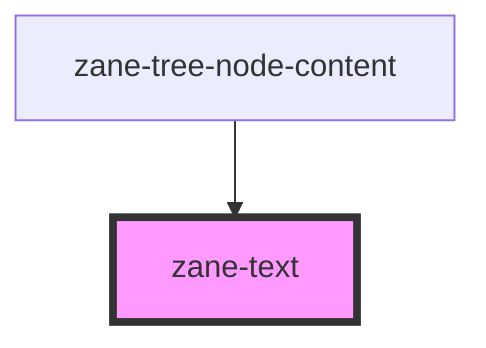

# zane-text

<!-- Auto Generated Below -->

## Properties

| Property    | Attribute    | Description | Type                                                              | Default     |
| ----------- | ------------ | ----------- | ----------------------------------------------------------------- | ----------- |
| `lineClamp` | `line-clamp` |             | `string`                                                          | `undefined` |
| `size`      | `size`       |             | `"" \| "default" \| "large" \| "small"`                           | `''`        |
| `truncated` | `truncated`  |             | `boolean`                                                         | `false`     |
| `type`      | `type`       |             | `"" \| "danger" \| "info" \| "primary" \| "success" \| "warning"` | `''`        |

## Dependencies

### Used by

 - [zane-tree-node-content](../tree)

### Graph

----------------------------------------------

*Built with [StencilJS](https://stenciljs.com/)*
