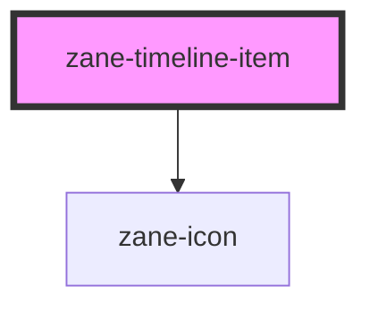

# zane-timeline-item

<!-- Auto Generated Below -->

## Properties

| Property        | Attribute        | Description            | Type                                                              | Default     |
| --------------- | ---------------- | ---------------------- | ----------------------------------------------------------------- | ----------- |
| `center`        | `center`         | 是否垂直居中                 | `boolean`                                                         | `false`     |
| `color`         | `color`          | 节点颜色                   | `string`                                                          | `''`        |
| `hideTimestamp` | `hide-timestamp` | 是否隐藏时间戳                | `boolean`                                                         | `false`     |
| `hollow`        | `hollow`         | 是否空心点                  | `boolean`                                                         | `false`     |
| `icon`          | `icon`           | 自定义图标名称（@zanejs/icons） | `string`                                                          | `undefined` |
| `placement`     | `placement`      | 时间戳位置                  | `"bottom" \| "top"`                                               | `'bottom'`  |
| `size`          | `size`           | 节点尺寸                   | `"large" \| "normal"`                                             | `'normal'`  |
| `timestamp`     | `timestamp`      | 时间戳内容                  | `string`                                                          | `''`        |
| `type`          | `type`           | 节点类型                   | `"" \| "danger" \| "info" \| "primary" \| "success" \| "warning"` | `''`        |

## Dependencies

### Depends on

- [zane-icon](../icon)

### Graph

----------------------------------------------

*Built with [StencilJS](https://stenciljs.com/)*
