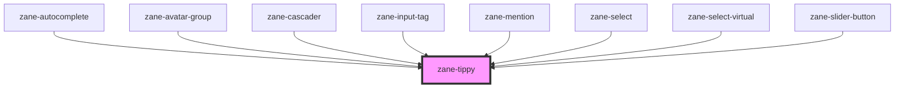

# zane-tippy

<!-- Auto Generated Below -->

## Properties

| Property                 | Attribute              | Description            | Type                                                                                                                                                                                                         | Default                                     |
| ------------------------ | ---------------------- | ---------------------- | ------------------------------------------------------------------------------------------------------------------------------------------------------------------------------------------------------------ | ------------------------------------------- |
| `allowHTML`              | `allow-h-t-m-l`        |                        | `boolean`                                                                                                                                                                                                    | `tippy.defaultProps.allowHTML`              |
| `animateFill`            | `animate-fill`         |                        | `boolean`                                                                                                                                                                                                    | `tippy.defaultProps.animateFill`            |
| `animation`              | `animation`            |                        | `boolean \| string`                                                                                                                                                                                          | `tippy.defaultProps.animation`              |
| `appendTo`               | `append-to`            |                        | `"parent" \| ((ref: Element) => Element) \| Element`                                                                                                                                                         | `tippy.defaultProps.appendTo`               |
| `aria`                   | --                     |                        | `{ content?: "auto" \| "describedby" \| "labelledby"; expanded?: boolean \| "auto"; }`                                                                                                                       | `tippy.defaultProps.aria`                   |
| `arrow`                  | `arrow`                |                        | `DocumentFragment \| SVGElement \| boolean \| string`                                                                                                                                                        | `tippy.defaultProps.arrow`                  |
| `boxClass`               | `box-class`            |                        | `string`                                                                                                                                                                                                     | `''`                                        |
| `boxStyle`               | --                     |                        | `any \| string`                                                                                                                                                                                              | `undefined`                                 |
| `content`                | `content`              | 内容支持字符串（直接作为 HTML 或文本） | `string`                                                                                                                                                                                                     | `undefined`                                 |
| `contentClass`           | `content-class`        |                        | `string`                                                                                                                                                                                                     | `''`                                        |
| `contentStyle`           | --                     |                        | `any \| string`                                                                                                                                                                                              | `undefined`                                 |
| `contentTag`             | `content-tag`          |                        | `string`                                                                                                                                                                                                     | `'span'`                                    |
| `delay`                  | `delay`                |                        | `[number, number] \| number`                                                                                                                                                                                 | `tippy.defaultProps.delay`                  |
| `disabled`               | `disabled`             |                        | `boolean`                                                                                                                                                                                                    | `false`                                     |
| `duration`               | `duration`             |                        | `[number, number] \| number`                                                                                                                                                                                 | `tippy.defaultProps.duration`               |
| `followCursor`           | `follow-cursor`        |                        | `"horizontal" \| "initial" \| "vertical" \| boolean`                                                                                                                                                         | `tippy.defaultProps.followCursor`           |
| `getReferenceClientRect` | --                     |                        | `GetReferenceClientRect`                                                                                                                                                                                     | `tippy.defaultProps.getReferenceClientRect` |
| `hideOnClick`            | `hide-on-click`        |                        | `"toggle" \| boolean`                                                                                                                                                                                        | `tippy.defaultProps.hideOnClick`            |
| `ignoreAttributes`       | `ignore-attributes`    |                        | `boolean`                                                                                                                                                                                                    | `tippy.defaultProps.ignoreAttributes`       |
| `inertia`                | `inertia`              |                        | `boolean`                                                                                                                                                                                                    | `tippy.defaultProps.inertia`                |
| `inlinePositioning`      | `inline-positioning`   |                        | `boolean`                                                                                                                                                                                                    | `tippy.defaultProps.inlinePositioning`      |
| `interactive`            | `interactive`          |                        | `boolean`                                                                                                                                                                                                    | `tippy.defaultProps.interactive`            |
| `interactiveBorder`      | `interactive-border`   |                        | `number`                                                                                                                                                                                                     | `tippy.defaultProps.interactiveBorder`      |
| `interactiveDebounce`    | `interactive-debounce` |                        | `number`                                                                                                                                                                                                     | `tippy.defaultProps.interactiveDebounce`    |
| `maxWidth`               | `max-width`            |                        | `number \| string`                                                                                                                                                                                           | `tippy.defaultProps.maxWidth`               |
| `moveTransition`         | `move-transition`      |                        | `string`                                                                                                                                                                                                     | `tippy.defaultProps.moveTransition`         |
| `offset`                 | --                     |                        | `(({ placement, popper, reference, }: { placement: Placement; popper: Rect; reference: Rect; }) => [number, number]) \| [number, number]`                                                                    | `tippy.defaultProps.offset`                 |
| `placement`              | `placement`            |                        | `"auto" \| "auto-end" \| "auto-start" \| "bottom" \| "bottom-end" \| "bottom-start" \| "left" \| "left-end" \| "left-start" \| "right" \| "right-end" \| "right-start" \| "top" \| "top-end" \| "top-start"` | `tippy.defaultProps.placement`              |
| `plugins`                | --                     |                        | `Plugin<unknown>[]`                                                                                                                                                                                          | `tippy.defaultProps.plugins`                |
| `popperOptions`          | --                     |                        | `{ placement: Placement; modifiers: Partial<Modifier<any, any>>[]; strategy: PositioningStrategy; onFirstUpdate?: (arg0: Partial<State>) => void; }`                                                         | `tippy.defaultProps.popperOptions`          |
| `role`                   | `role`                 |                        | `string`                                                                                                                                                                                                     | `tippy.defaultProps.role`                   |
| `showOnCreate`           | `show-on-create`       |                        | `boolean`                                                                                                                                                                                                    | `tippy.defaultProps.showOnCreate`           |
| `sticky`                 | `sticky`               |                        | `"popper" \| "reference" \| boolean`                                                                                                                                                                         | `tippy.defaultProps.sticky`                 |
| `tag`                    | `tag`                  |                        | `string`                                                                                                                                                                                                     | `'span'`                                    |
| `theme`                  | `theme`                |                        | `string`                                                                                                                                                                                                     | `tippy.defaultProps.theme`                  |
| `tippyRender`            | --                     |                        | `(instance: Instance<Props>) => { popper: PopperElement<Props>; onUpdate?: (prevProps: Props, nextProps: Props) => void; }`                                                                                  | `tippy.defaultProps.render`                 |
| `to`                     | `to`                   |                        | `HTMLElement \| string`                                                                                                                                                                                      | `undefined`                                 |
| `touch`                  | `touch`                |                        | `"hold" \| ["hold", number] \| boolean`                                                                                                                                                                      | `tippy.defaultProps.touch`                  |
| `trigger`                | `trigger`              |                        | `string`                                                                                                                                                                                                     | `tippy.defaultProps.trigger`                |
| `triggerTarget`          | --                     |                        | `Element \| Element[]`                                                                                                                                                                                       | `tippy.defaultProps.triggerTarget`          |
| `zIndex`                 | `z-index`              |                        | `number`                                                                                                                                                                                                     | `tippy.defaultProps.zIndex`                 |

## Events

| Event          | Description | Type                                                                                                                   |
| -------------- | ----------- | ---------------------------------------------------------------------------------------------------------------------- |
| `afterUpdate`  |             | `CustomEvent<[Instance<Props>, Partial<Props>]>`                                                                       |
| `beforeUpdate` |             | `CustomEvent<[Instance<Props>, Partial<Props>]>`                                                                       |
| `clickOutside` |             | `CustomEvent<[Instance<Props>, Event]>`                                                                                |
| `create`       |             | `CustomEvent<Instance<Props>>`                                                                                         |
| `destroy`      |             | `CustomEvent<Instance<Props>>`                                                                                         |
| `hidden`       |             | `CustomEvent<Instance<Props>>`                                                                                         |
| `mount`        |             | `CustomEvent<Instance<Props>>`                                                                                         |
| `shown`        |             | `CustomEvent<Instance<Props>>`                                                                                         |
| `state`        |             | `CustomEvent<{ isEnabled: boolean; isVisible: boolean; isDestroyed: boolean; isMounted: boolean; isShown: boolean; }>` |
| `trigger`      |             | `CustomEvent<[Instance<Props>, Event]>`                                                                                |
| `untrigger`    |             | `CustomEvent<[Instance<Props>, Event]>`                                                                                |
| `zHide`        |             | `CustomEvent<Instance<Props>>`                                                                                         |
| `zShow`        |             | `CustomEvent<Instance<Props>>`                                                                                         |

## Methods

### `destroy() => Promise<void>`

#### Returns

Type: `Promise<void>`

### `disable() => Promise<void>`

#### Returns

Type: `Promise<void>`

### `enable() => Promise<void>`

#### Returns

Type: `Promise<void>`

### `hide() => Promise<void>`

#### Returns

Type: `Promise<void>`

### `isFocusInsideContent(event?: FocusEvent) => Promise<boolean>`

#### Parameters

| Name    | Type         | Description |
| ------- | ------------ | ----------- |
| `event` | `FocusEvent` |             |

#### Returns

Type: `Promise<boolean>`

### `isVisible() => Promise<boolean>`

#### Returns

Type: `Promise<boolean>`

### `setContent(newContent: string | HTMLElement) => Promise<void>`

#### Parameters

| Name         | Type                    | Description |
| ------------ | ----------------------- | ----------- |
| `newContent` | `string \| HTMLElement` |             |

#### Returns

Type: `Promise<void>`

### `show() => Promise<void>`

#### Returns

Type: `Promise<void>`

### `updateTippyProps() => Promise<void>`

#### Returns

Type: `Promise<void>`

## Dependencies

### Used by

 - [zane-autocomplete](../autocomplete)
 - [zane-avatar-group](../avatar)
 - [zane-cascader](../cascader)
 - [zane-input-tag](../input-tag)
 - [zane-mention](../mention)
 - [zane-select](../select)
 - [zane-select-virtual](../select-virtual)
 - [zane-slider-button](../slider)

### Graph

----------------------------------------------

*Built with [StencilJS](https://stenciljs.com/)*
