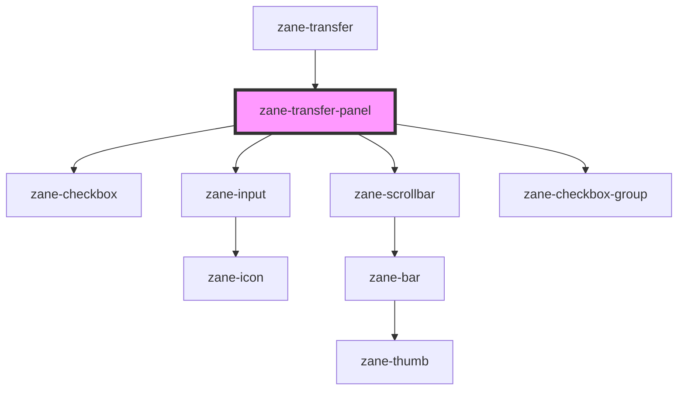

# zane-transfer-panel

<!-- Auto Generated Below -->

## Properties

| Property         | Attribute     | Description | Type                                                 | Default                                                              |
| ---------------- | ------------- | ----------- | ---------------------------------------------------- | -------------------------------------------------------------------- |
| `data`           | --            |             | `TransferDataItem[]`                                 | `[]`                                                                 |
| `defaultChecked` | --            |             | `TransferKey[]`                                      | `[]`                                                                 |
| `filterMethod`   | --            |             | `(query: string, item: TransferDataItem) => boolean` | `undefined`                                                          |
| `filterable`     | `filterable`  |             | `boolean`                                            | `false`                                                              |
| `format`         | --            |             | `TransferFormat`                                     | `{}`                                                                 |
| `optionRender`   | --            |             | `(option: TransferDataItem) => VNode \| VNode[]`     | `undefined`                                                          |
| `placeholder`    | `placeholder` |             | `string`                                             | `undefined`                                                          |
| `props`          | --            |             | `TransferPropsAlias`                                 | `{     label: 'label',     key: 'key',     disabled: 'disabled'   }` |
| `zTitle`         | `title`       |             | `string`                                             | `undefined`                                                          |

## Events

| Event            | Description | Type                                                                |
| ---------------- | ----------- | ------------------------------------------------------------------- |
| `zCheckedChange` |             | `CustomEvent<{ value: TransferKey[]; movedKeys?: TransferKey[]; }>` |

## Methods

### `updateQuery(query: string) => Promise<void>`

#### Parameters

| Name    | Type     | Description |
| ------- | -------- | ----------- |
| `query` | `string` |             |

#### Returns

Type: `Promise<void>`

## Dependencies

### Used by

 - [zane-transfer](.)

### Depends on

- [zane-checkbox](../checkbox)
- [zane-input](../input)
- [zane-scrollbar](../scrollbar)
- [zane-checkbox-group](../checkbox)

### Graph

----------------------------------------------

*Built with [StencilJS](https://stenciljs.com/)*
