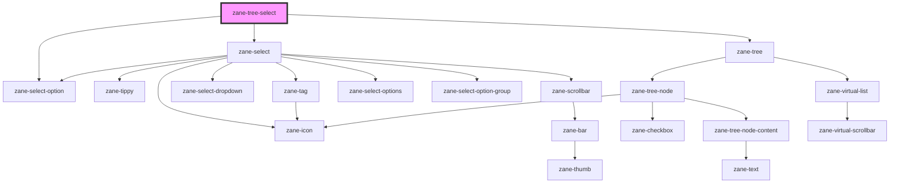

# zane-tree-select

<!-- Auto Generated Below -->

## Properties

| Property              | Attribute               | Description | Type                                                                                                                                                                                                         | Default                       |
| --------------------- | ----------------------- | ----------- | ------------------------------------------------------------------------------------------------------------------------------------------------------------------------------------------------------------ | ----------------------------- |
| `accordion`           | `accordion`             |             | `boolean`                                                                                                                                                                                                    | `false`                       |
| `allowCreate`         | `allow-create`          |             | `boolean`                                                                                                                                                                                                    | `undefined`                   |
| `appendTo`            | `append-to`             |             | `"parent" \| ((ref: Element) => Element) \| Element`                                                                                                                                                         | `tippy.defaultProps.appendTo` |
| `ariaLabel`           | `aria-label`            |             | `string`                                                                                                                                                                                                     | `undefined`                   |
| `autocomplete`        | `autocomplete`          |             | `string`                                                                                                                                                                                                     | `'off'`                       |
| `automaticDropdown`   | `automatic-dropdown`    |             | `boolean`                                                                                                                                                                                                    | `undefined`                   |
| `cacheData`           | --                      |             | `TreeNodeData[]`                                                                                                                                                                                             | `[]`                          |
| `checkOnClickLeaf`    | `check-on-click-leaf`   |             | `boolean`                                                                                                                                                                                                    | `true`                        |
| `checkOnClickNode`    | `check-on-click-node`   |             | `boolean`                                                                                                                                                                                                    | `false`                       |
| `checkStrictly`       | `check-strictly`        |             | `boolean`                                                                                                                                                                                                    | `false`                       |
| `clearIcon`           | `clear-icon`            |             | `string`                                                                                                                                                                                                     | `'close-circle-line'`         |
| `clearable`           | `clearable`             |             | `boolean`                                                                                                                                                                                                    | `undefined`                   |
| `collapseTags`        | `collapse-tags`         |             | `boolean`                                                                                                                                                                                                    | `undefined`                   |
| `collapseTagsTooltip` | `collapse-tags-tooltip` |             | `boolean`                                                                                                                                                                                                    | `undefined`                   |
| `currentNodeKey`      | `current-node-key`      |             | `number \| string`                                                                                                                                                                                           | `undefined`                   |
| `data`                | --                      |             | `TreeNodeData[]`                                                                                                                                                                                             | `[]`                          |
| `debounce`            | `debounce`              |             | `number`                                                                                                                                                                                                     | `300`                         |
| `defaultCheckedKeys`  | --                      |             | `TreeKey[]`                                                                                                                                                                                                  | `[]`                          |
| `defaultExpandedKeys` | --                      |             | `TreeKey[]`                                                                                                                                                                                                  | `[]`                          |
| `defaultFirstOption`  | `default-first-option`  |             | `boolean`                                                                                                                                                                                                    | `undefined`                   |
| `disabled`            | `disabled`              |             | `boolean`                                                                                                                                                                                                    | `undefined`                   |
| `emptyText`           | `empty-text`            |             | `string`                                                                                                                                                                                                     | `undefined`                   |
| `emptyValues`         | --                      |             | `any[]`                                                                                                                                                                                                      | `undefined`                   |
| `expandOnClickNode`   | `expand-on-click-node`  |             | `boolean`                                                                                                                                                                                                    | `true`                        |
| `filterMethod`        | --                      |             | `(query: any) => any`                                                                                                                                                                                        | `undefined`                   |
| `filterNodeMethod`    | --                      |             | `(query: string, data: TreeNodeData, node: TreeNode) => boolean`                                                                                                                                             | `undefined`                   |
| `filterable`          | `filterable`            |             | `boolean`                                                                                                                                                                                                    | `undefined`                   |
| `fitInputWidth`       | `fit-input-width`       |             | `boolean`                                                                                                                                                                                                    | `undefined`                   |
| `height`              | `height`                |             | `number`                                                                                                                                                                                                     | `undefined`                   |
| `highlightCurrent`    | `highlight-current`     |             | `boolean`                                                                                                                                                                                                    | `false`                       |
| `icon`                | `icon`                  |             | `string`                                                                                                                                                                                                     | `undefined`                   |
| `indent`              | `indent`                |             | `number`                                                                                                                                                                                                     | `16`                          |
| `itemSize`            | `item-size`             |             | `number`                                                                                                                                                                                                     | `26`                          |
| `label`               | `label`                 |             | `string`                                                                                                                                                                                                     | `undefined`                   |
| `loading`             | `loading`               |             | `boolean`                                                                                                                                                                                                    | `undefined`                   |
| `loadingText`         | `loading-text`          |             | `string`                                                                                                                                                                                                     | `undefined`                   |
| `maxCollapseTags`     | `max-collapse-tags`     |             | `number`                                                                                                                                                                                                     | `1`                           |
| `multiple`            | `multiple`              |             | `boolean`                                                                                                                                                                                                    | `undefined`                   |
| `multipleLimit`       | `multiple-limit`        |             | `number`                                                                                                                                                                                                     | `0`                           |
| `name`                | `name`                  |             | `string`                                                                                                                                                                                                     | `undefined`                   |
| `noDataText`          | `no-data-text`          |             | `string`                                                                                                                                                                                                     | `undefined`                   |
| `noMatchText`         | `no-match-text`         |             | `string`                                                                                                                                                                                                     | `undefined`                   |
| `offset`              | --                      |             | `(({ placement, popper, reference, }: { placement: Placement; popper: Rect; reference: Rect; }) => [number, number]) \| [number, number]`                                                                    | `tippy.defaultProps.offset`   |
| `options`             | --                      |             | `Record<string, any>[]`                                                                                                                                                                                      | `undefined`                   |
| `perfMode`            | `perf-mode`             |             | `boolean`                                                                                                                                                                                                    | `true`                        |
| `placeholder`         | `placeholder`           |             | `string`                                                                                                                                                                                                     | `undefined`                   |
| `placement`           | `placement`             |             | `"auto" \| "auto-end" \| "auto-start" \| "bottom" \| "bottom-end" \| "bottom-start" \| "left" \| "left-end" \| "left-start" \| "right" \| "right-end" \| "right-start" \| "top" \| "top-end" \| "top-start"` | `'bottom-start'`              |
| `popperOptions`       | --                      |             | `{ placement: Placement; modifiers: Partial<Modifier<any, any>>[]; strategy: PositioningStrategy; onFirstUpdate?: (arg0: Partial<State>) => void; }`                                                         | `{}`                          |
| `popperTheme`         | `popper-theme`          |             | `string`                                                                                                                                                                                                     | `undefined`                   |
| `props`               | --                      |             | `{ children?: string; label?: string; value?: string; disabled?: string; isLeaf?: string; class?: string; }`                                                                                                 | `{ ...defaultProps }`         |
| `remote`              | `remote`                |             | `boolean`                                                                                                                                                                                                    | `undefined`                   |
| `remoteMethod`        | --                      |             | `(query: any) => any`                                                                                                                                                                                        | `undefined`                   |
| `remoteShowSuffix`    | `remote-show-suffix`    |             | `boolean`                                                                                                                                                                                                    | `undefined`                   |
| `reserveKeyword`      | `reserve-keyword`       |             | `boolean`                                                                                                                                                                                                    | `true`                        |
| `scrollbarAlwaysOn`   | `scrollbar-always-on`   |             | `boolean`                                                                                                                                                                                                    | `false`                       |
| `showArrow`           | `show-arrow`            |             | `boolean`                                                                                                                                                                                                    | `false`                       |
| `showCheckbox`        | `show-checkbox`         |             | `boolean`                                                                                                                                                                                                    | `false`                       |
| `size`                | `size`                  |             | `"" \| "default" \| "large" \| "small"`                                                                                                                                                                      | `undefined`                   |
| `suffixIcon`          | `suffix-icon`           |             | `string`                                                                                                                                                                                                     | `'arrow-down-s-line'`         |
| `tagEffect`           | `tag-effect`            |             | `"dark" \| "light" \| "plain"`                                                                                                                                                                               | `'light'`                     |
| `tagLabelRender`      | --                      |             | `(label: string \| number \| boolean, value: TreeSelectOptionValue, index: number) => HTMLElement`                                                                                                           | `undefined`                   |
| `tagRender`           | --                      |             | `() => HTMLElement`                                                                                                                                                                                          | `undefined`                   |
| `tagTooltip`          | --                      |             | `TagTooltipProps`                                                                                                                                                                                            | `{}`                          |
| `tagType`             | `tag-type`              |             | `"danger" \| "info" \| "primary" \| "success" \| "warning"`                                                                                                                                                  | `'info'`                      |
| `validateEvent`       | `validate-event`        |             | `boolean`                                                                                                                                                                                                    | `true`                        |
| `value`               | `value`                 |             | `TreeSelectOptionValue[] \| any \| boolean \| number \| string`                                                                                                                                              | `undefined`                   |
| `valueKey`            | `value-key`             |             | `string`                                                                                                                                                                                                     | `'value'`                     |
| `valueOnClear`        | `value-on-clear`        |             | `any`                                                                                                                                                                                                        | `undefined`                   |
| `zId`                 | `id`                    |             | `string`                                                                                                                                                                                                     | `undefined`                   |
| `zTabIndex`           | `tabindex`              |             | `number`                                                                                                                                                                                                     | `0`                           |

## Events

| Event                | Description | Type                                                                      |
| -------------------- | ----------- | ------------------------------------------------------------------------- |
| `zBlur`              |             | `CustomEvent<FocusEvent>`                                                 |
| `zChange`            |             | `CustomEvent<any>`                                                        |
| `zClear`             |             | `CustomEvent<any>`                                                        |
| `zCompositionEnd`    |             | `CustomEvent<CompositionEvent>`                                           |
| `zCompositionStart`  |             | `CustomEvent<CompositionEvent>`                                           |
| `zCompositionUpdate` |             | `CustomEvent<CompositionEvent>`                                           |
| `zCurrentChange`     |             | `CustomEvent<{ data: TreeNodeData; node: TreeNode; }>`                    |
| `zFocus`             |             | `CustomEvent<FocusEvent>`                                                 |
| `zNodeCheck`         |             | `CustomEvent<{ data: TreeNodeData; checkedInfo: CheckedInfo; }>`          |
| `zNodeCheckChange`   |             | `CustomEvent<{ data: TreeNodeData; checked: CheckboxValueType; }>`        |
| `zNodeClick`         |             | `CustomEvent<{ data: TreeNodeData; node: TreeNode; event: MouseEvent; }>` |
| `zNodeCollapse`      |             | `CustomEvent<{ data: TreeNodeData; node: TreeNode; }>`                    |
| `zNodeContextMenu`   |             | `CustomEvent<{ data: TreeNodeData; node: TreeNode; event: Event; }>`      |
| `zNodeDrop`          |             | `CustomEvent<{ data: TreeNodeData; node: TreeNode; event: DragEvent; }>`  |
| `zNodeExpand`        |             | `CustomEvent<{ data: TreeNodeData; node: TreeNode; }>`                    |
| `zPopupScroll`       |             | `CustomEvent<{ scrollTop: number; scrollLeft: number; }>`                 |
| `zRemoveTag`         |             | `CustomEvent<any>`                                                        |
| `zVisibleChange`     |             | `CustomEvent<boolean>`                                                    |

## Dependencies

### Depends on

- [zane-select](../select)
- [zane-select-option](../select)
- [zane-tree](../tree)

### Graph

----------------------------------------------

*Built with [StencilJS](https://stenciljs.com/)*
