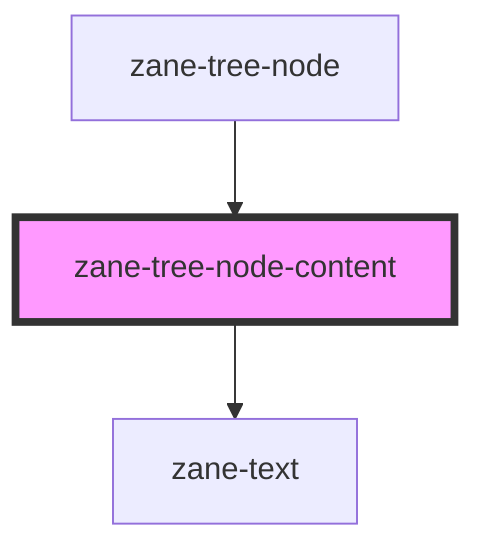

# zane-tree-node-content

<!-- Auto Generated Below -->

## Properties

| Property | Attribute | Description | Type                                                                                                                                                                                                       | Default     |
| -------- | --------- | ----------- | ---------------------------------------------------------------------------------------------------------------------------------------------------------------------------------------------------------- | ----------- |
| `node`   | --        |             | `{ key: TreeKey; level: number; parent?: TreeNode; children?: TreeNode[]; data: TreeNodeData; disabled?: boolean; label?: string; isLeaf?: boolean; expanded?: boolean; isEffectivelyChecked?: boolean; }` | `undefined` |

## Dependencies

### Used by

 - [zane-tree-node](.)

### Depends on

- [zane-text](../text)

### Graph

----------------------------------------------

*Built with [StencilJS](https://stenciljs.com/)*
