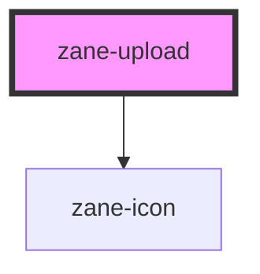

# zane-upload

<!-- Auto Generated Below -->

## Properties

| Property          | Attribute          | Description | Type                                                                                         | Default     |
| ----------------- | ------------------ | ----------- | -------------------------------------------------------------------------------------------- | ----------- |
| `accept`          | `accept`           |             | `string`                                                                                     | `""`        |
| `action`          | `action`           |             | `string`                                                                                     | `"#"`       |
| `autoUpload`      | `auto-upload`      |             | `boolean`                                                                                    | `true`      |
| `beforeRemove`    | --                 |             | `(file: UploadFile, fileList: UploadFile[]) => boolean \| Promise<boolean> \| Promise<void>` | `undefined` |
| `beforeUpload`    | --                 |             | `(file: File) => boolean \| Promise<void>`                                                   | `undefined` |
| `data`            | --                 |             | `string \| unknown`                                                                          | `{}`        |
| `disabled`        | `disabled`         |             | `boolean`                                                                                    | `false`     |
| `drag`            | `drag`             |             | `boolean`                                                                                    | `false`     |
| `headers`         | --                 |             | `string`                                                                                     | `{}`        |
| `httpRequest`     | --                 |             | `(options: UploadRequestOptions) => void \| Promise<void>`                                   | `undefined` |
| `limit`           | `limit`            |             | `number`                                                                                     | `undefined` |
| `listType`        | `list-type`        |             | `"picture" \| "picture-card" \| "text"`                                                      | `"text"`    |
| `method`          | `method`           |             | `string`                                                                                     | `"post"`    |
| `multiple`        | `multiple`         |             | `boolean`                                                                                    | `false`     |
| `name`            | `name`             |             | `string`                                                                                     | `"file"`    |
| `showFileList`    | `show-file-list`   |             | `boolean`                                                                                    | `true`      |
| `withCredentials` | `with-credentials` |             | `boolean`                                                                                    | `false`     |

## Events

| Event       | Description | Type                                                      |
| ----------- | ----------- | --------------------------------------------------------- |
| `zChange`   |             | `CustomEvent<UploadChangeOptions>`                        |
| `zError`    |             | `CustomEvent<{ error: Error; file: UploadFile; }>`        |
| `zExceed`   |             | `CustomEvent<{ files: File[]; fileList: UploadFile[]; }>` |
| `zPreview`  |             | `CustomEvent<UploadFile>`                                 |
| `zProgress` |             | `CustomEvent<{ percent: number; file: UploadFile; }>`     |
| `zRemove`   |             | `CustomEvent<UploadFile>`                                 |
| `zSuccess`  |             | `CustomEvent<{ response: any; file: UploadFile; }>`       |

## Methods

### `abort(file?: UploadFile) => Promise<void>`

#### Parameters

| Name   | Type         | Description |
| ------ | ------------ | ----------- |
| `file` | `UploadFile` |             |

#### Returns

Type: `Promise<void>`

### `clearFiles() => Promise<void>`

#### Returns

Type: `Promise<void>`

### `submit() => Promise<void>`

#### Returns

Type: `Promise<void>`

## Dependencies

### Depends on

- [zane-icon](../icon)

### Graph

----------------------------------------------

*Built with [StencilJS](https://stenciljs.com/)*
