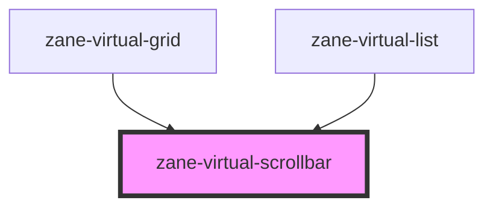

# zane-virtual-scrollbar

<!-- Auto Generated Below -->

## Properties

| Property        | Attribute        | Description | Type                         | Default      |
| --------------- | ---------------- | ----------- | ---------------------------- | ------------ |
| `alwaysOn`      | `always-on`      |             | `boolean`                    | `undefined`  |
| `clientSize`    | `client-size`    |             | `number`                     | `undefined`  |
| `endGap`        | `end-gap`        |             | `number`                     | `2`          |
| `layout`        | `layout`         |             | `"horizontal" \| "vertical"` | `'vertical'` |
| `ratio`         | `ratio`          |             | `number`                     | `undefined`  |
| `scrollFrom`    | `scroll-from`    |             | `number`                     | `undefined`  |
| `scrollbarSize` | `scrollbar-size` |             | `number`                     | `6`          |
| `startGap`      | `start-gap`      |             | `number`                     | `0`          |
| `total`         | `total`          |             | `number`                     | `undefined`  |
| `visible`       | `visible`        |             | `boolean`                    | `undefined`  |
| `wrapperClass`  | `wrapper-class`  |             | `string`                     | `undefined`  |

## Events

| Event        | Description | Type                                                     |
| ------------ | ----------- | -------------------------------------------------------- |
| `zScroll`    |             | `CustomEvent<{ distance: number; totalSteps: number; }>` |
| `zStartMove` |             | `CustomEvent<void>`                                      |
| `zStopMove`  |             | `CustomEvent<void>`                                      |

## Methods

### `onZMouseUp() => Promise<void>`

#### Returns

Type: `Promise<void>`

## Dependencies

### Used by

 - [zane-virtual-grid](.)
 - [zane-virtual-list](.)

### Graph

----------------------------------------------

*Built with [StencilJS](https://stenciljs.com/)*
